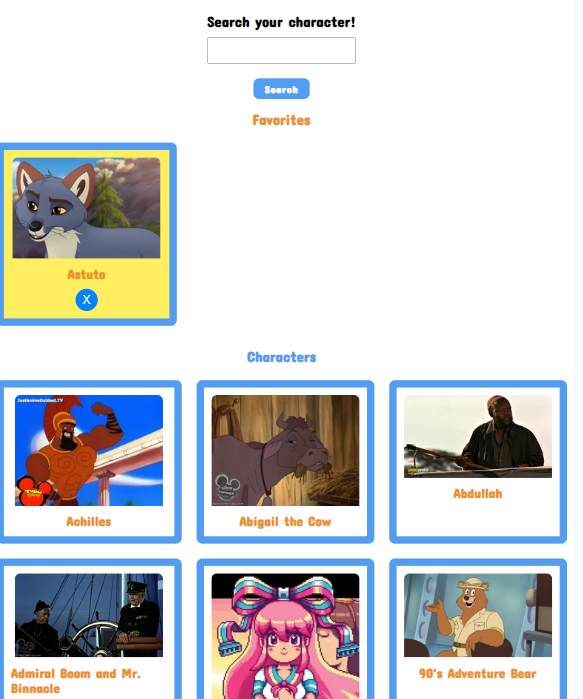

# FIND YOUR CHARACTER!

Bienvenid@s a FIND YOUR CHARACTER!, un lugar para explorar y descubrir las cartas de tus personajes favoritos de Disney. Esta aplicación es perfecta para niños y adultos amantes del mundo mágico y de aventuras de Disney.

## 1. Características Principales

- **Exploración Divertida**: Busca y descubre cartas con imagenes de una amplia variedad de personajes de Disney.
- **Guarda tus Favoritos**: ¡Guarda tus personajes preferidos para verlos facilmente!
- **Diseño Amigable para Niños y Adultos**: Una interfaz muy sencilla y colorida que atrae tanto a niños como a adultos.

## 2. Cómo Empezar

1. **Explora Personajes**: Dale click a START y Navega por la colección de personajes de Disney utilizando la barra de búsqueda o simplemente desplázate para ver algunos de ellos.

2. **Guarda tus Favoritos**: Haz clic en la carta de un personaje para añadirlo a tu lista de favoritos. También puedes quitarlo clickando de nuevo sobre ella o en la "X" de la carta.

3. **Accede a tus Favoritos**: La sección de Favoritos esta al inicio de la página. Allí podrás ver la lista de personajes que has guardado.

## 3. Aquí tenemos algunas capturas de pantalla de la página:

## 4. Tecnologías Utilizadas

### General

- **Estructura Organizada:**

  - Implementación de una estructura de ficheros y carpetas adecuada para un proyecto web.

- **Uso de Starter Kit:**

  - Implementación del Starter Kit como plantilla para organizar el código HTML, Sass y js en distintos ficheros.

- **Control de Versiones:**
  - Uso de control de versiones con una rama dev para gestionar de manera efectiva el desarrollo del proyecto.

### JavasCript

- **JavaScript Básico:**

  - Creación de código JavaScript con una sintaxis correcta y estructura bien organizada.

  - Uso de constantes y variables para almacenar información y reasignar valores.

  - Empleo de condicionales para ejecutar acciones diferentes según una condición dada.

  - Listados de Datos (Arrays): Manejo efectivo de listados de datos para organizar la información.

  - Utilización de funciones para estructurar el código de manera modular.

  - Modificación dinámica de la información del DOM para agregar contenido interactivo.

  - Escucha de eventos del DOM y respuesta adecuada a las interacciones del usuario.

  - Creación de peticiones mediante la API Fetch y el uso de promesas para manejar respuestas asincrónicas.

  - Utilización del localStorage para almacenar información en el navegador de manera persistente.

  - ...

---

Este proyecto se ha creado con un compromiso constante con las mejores prácticas aprendidas de desarrollo web para proporcionar una experiencia agradable y divertida a los usuarios.
